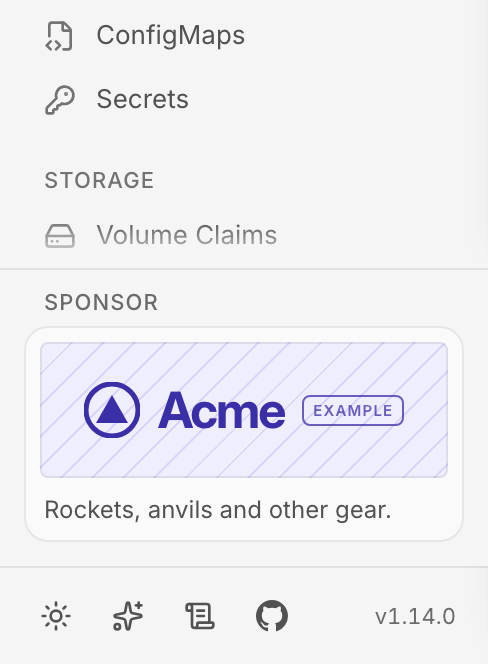
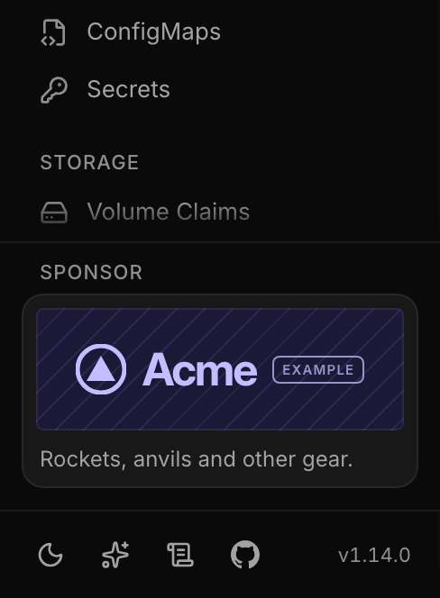
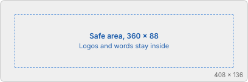

# Sponsoring Lumovi: the card, and what to send

Lumovi has one sponsor at a time. Their card sits at the bottom of the app's sidebar, above its
footer, in the desktop app, in the web UI Lumovi serves from a cluster, and in the fleet hub,
in light mode and dark. It's a picture, one line of text and a link, under the label
"Sponsor".

 

_Acme, at acme.example, is a placeholder: not a real company._

## The picture



| | |
| --- | --- |
| **Size** | **408 × 136 pixels**, exactly (3:1). The card shows it at 204 × 68, at twice the density, so it's sharp on every screen. |
| **Safe area** | Keep logos and words at least 24 pixels from every edge: inside the middle 360 × 88. |
| **Corners** | The card rounds them by 8 pixels, and draws a 1-pixel line around the picture. Don't draw your own border. |
| **Light and dark** | **Two versions, one for each mode.** Each is shown only in its mode, on the card's own color: `#fafafa` in light mode and `#181818` in dark. |
| **Background** | Fill it, or leave it transparent: transparent pixels show `#ffffff` in light mode and `#121212` in dark. |
| **Formats** | PNG, WebP, GIF or animated WebP, checked by what the file is, not its name. Not SVG, JPEG or AVIF. |
| **File size** | Up to 150 KB for a still picture, and 500 KB for an animated one, each. |

[`template.png`](template.png) is the canvas at its size, with the corners and the safe area.

## Animation

An animated picture is welcome, as long as it stays calm: Lumovi is open while people fix
things.

- **It plays once**, when the card appears, for **5 seconds at most**, then rests on its last
  frame. A file set to loop isn't accepted: send a GIF with no loop (no NETSCAPE2.0 block), or
  an animated WebP with a loop count of 1.
- **Its first frame stands on its own.** People who ask their system for less motion see only
  that frame, so it shows your logo and anything you need to say. The last frame is where it
  rests: best the same as the first.
- **No flashing** (never more than three flashes a second), and nothing fast.

## The words

| Field | Up to | |
| --- | --- | --- |
| `description` | 32 characters | The line under the picture: one line of plain text, in sentence case, with no emoji, links or line breaks. It's 200 pixels wide in Inter at 12 pixels; a longer line is cut with an ellipsis. |
| `name` | 40 characters | Your name, as people say it. |
| `alt` | 100 characters | What the picture says, for people who use a screen reader. Often just your name. |
| `link` | 200 characters | Where the card leads: an `https` address. |

## The link

- **`https` only.** People see its domain when they point at the card or move to it with the
  keyboard, so make it your own domain, not a redirect or a link shortener.
- It opens in the browser. Lumovi adds nothing to it and sends no referrer; you may add your own
  campaign parameters.
- **Lumovi counts nothing**: no views, no clicks. The app only reads this repository, as it reads
  GitHub for its updates.

## sponsor.json

What the card shows. Every Lumovi reads it from this repository's main branch: the desktop app
a few seconds after it starts, and a Lumovi server for the pages it serves; then every hour. So a
change here shows everywhere within the hour (GitHub's caching can add a few minutes), with no
release.

```json
{
  "version": 1,
  "mode": "sponsor",
  "lumovi": { "link": "https://github.com/sponsors/Lumovi" },
  "sponsor": {
    "name": "Acme",
    "description": "Rockets, anvils and other gear.",
    "link": "https://acme.example/",
    "alt": "Acme",
    "image": { "light": "acme-light.png", "dark": "acme-dark.png" },
    "until": "2026-12-31"
  }
}
```

| Field | |
| --- | --- |
| `version` | `1`. |
| `mode` | `"none"`: no card, and the sidebar is as it's always been. `"lumovi"`: Lumovi's own card, "Help keep Lumovi free.". `"sponsor"`: the sponsor's card. |
| `lumovi.link` | Where Lumovi's own card leads, as an `https` address. Optional: without it, [Lumovi's GitHub Sponsors page](https://github.com/sponsors/Lumovi). |
| `sponsor` | The sponsor's card, with the words above. It must be there when `mode` is `"sponsor"`, and it's checked whenever it's there. |
| `sponsor.image` | The pictures' file names, next to `sponsor.json`, one for `light` mode and one for `dark`: letters, digits, `.`, `_` and `-`. |
| `sponsor.until` | The card's last day, as `YYYY-MM-DD`: it shows until the end of that day, UTC. Optional. After it, Lumovi shows its own card. |

Nothing else goes in it: a misspelt field fails the check, rather than being quietly ignored.
Every change comes as a pull request, and merges once the check passes.

## What's checked

Every change to this repository is checked: the pictures' real type, their size in pixels and in
bytes, their animation, the words' lengths and the link. The app checks again what it reads. If
anything doesn't pass, or can't be reached, Lumovi shows its own card instead: never an empty or
broken one.
